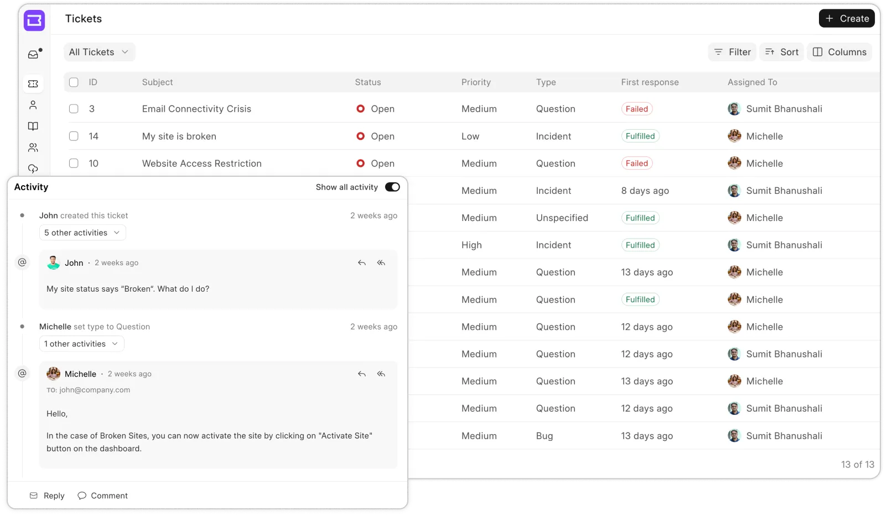

<div align="center" markdown="1">
	<a href="https://frappedesk.com/">
		
	</a>
	<h2>Frappe Helpdesk</h2>
	<p align="center">
	<p>Modern, Streamlined, Customer Service Software</p>
	</p>
  
[frappedesk.com](https://frappedesk.com)

<div align="center" style="max-height: 40px;">
	<a href="https://frappecloud.com/helpdesk/signup">
		
	</a>
</div>
</div>

---

Frappe Helpdesk offers an easy setup, clean user interface, and automation tools to resolve customer issues efficiently. It is based on Frappe Framework. It lets you streamline your company's support and helps you to efficiently manage your customer queries. It can help you to,

-   Create tickets from email or help center
-   Empower customers with a comprehensive knowledge base and self-service portal
-   Automate redundant tasks like agent assignment and set up triggers to notify agents and customers based on certain events



## Installation

1. Install and setup bench by following [this guide](https://frappeframework.com/docs/user/en/installation)
2. In the bench directory, run `bench start` and keep it running
3. Open another terminal in bench directory, and run these commands

	```
	bench get-app helpdesk
	bench new-site helpdesk.test
	bench --site helpdesk.test install-app helpdesk
	bench --site helpdesk.test add-to-hosts
	```

	You can now access Helpdesk at `http://helpdesk.test`
5. You can also run a development server by following theses steps, in Helpdesk
   directory (`apps/helpdesk`)

   ```
   yarn
   yarn dev
   ```

   Development server will be now available at `http://localhost:8080`

## Contributions and Community

There are many ways you can contribute even if you don't code:

1. You can start by giving a star to this repository!
2. If you find any issues, even if it is a typo, you can [raise an issue](https://github.com/frappe/desk/issues/new) to inform us.
3. Join our [Telegram group](https://t.me/frappedesk) and share your thoughts.

## License

[GNU Affero General Public License v3.0](/licence.md)
