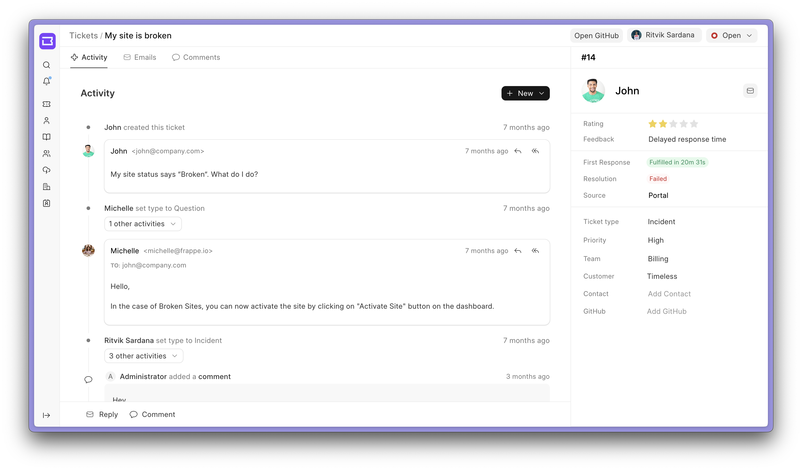
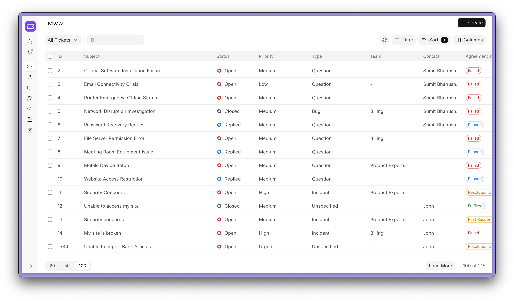
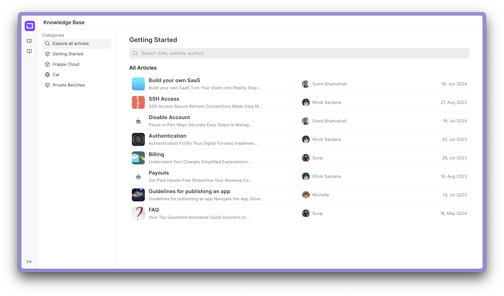
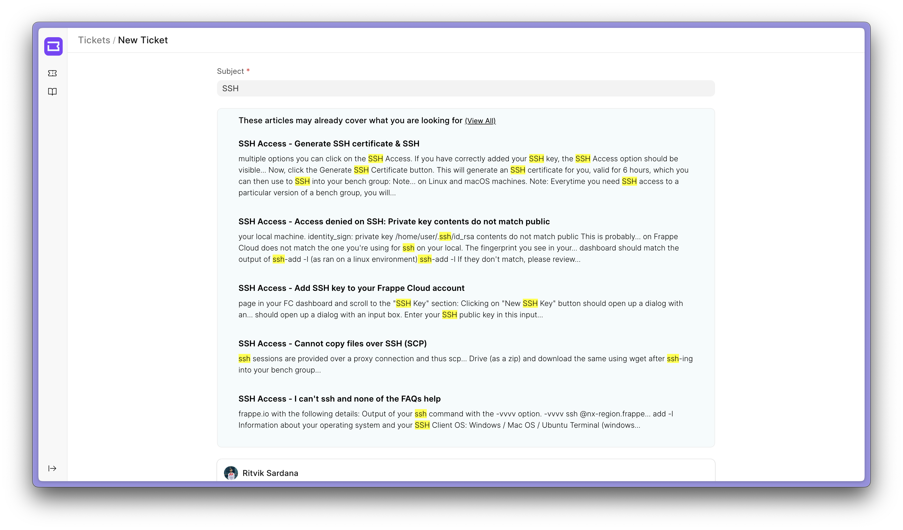
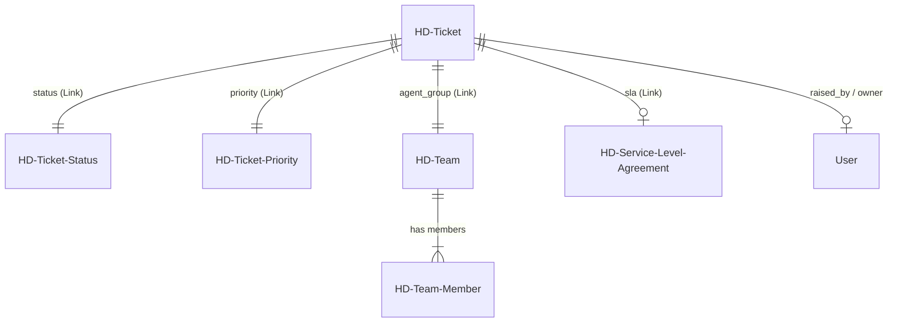

<div align="center" markdown="1">


<h1>Frappe Helpdesk</h1>

**Customer Service, Made Simple and Effective**


[](https://codecov.io/github/frappe/helpdesk)

<a href="https://trendshift.io/repositories/12764" target="_blank"></a>
</div>

</div>


<div align="center">
	
</div>
<br />
<div align="center">
	<a href="https://frappe.io/helpdesk">Website</a>
	-
	<a href="https://docs.frappe.io/helpdesk">Documentation</a>
</div>

## Frappe Helpdesk
Frappe Helpdesk is an 100% open-source Ticket Management tool which helps you  streamline your company's support, offers an easy setup, clean user interface, and automation tools to resolve customer queries efficiently.


### Motivation
Managing issues from our customers was a big challenge for us. We were using the ERPNext support module which was not very good in UI and the UX was also not good. We wanted to have a tool that can be easily integrated with our existing system and can be customized as per our needs. So we decided to build Frappe Helpdesk.

### Key Features

- **Agent and Customer Portal Views**: Dual portals for agents and customers to simplify issue submission and management.

- **Customizable SLAs**: Discover how you can set and track SLAs for better response times.

- **Assignment Rules**: Custom auto-assignment of tickets based on priority, issue type, or workload.

- **Knowledge Base**: Learn how to create and manage help articles to empower users and reduce tickets.

- **Saved Replies**: Pre-written replies for common queries to ensure quick and consistent communication.

<details open>
<summary >View Screenshots</summary>
<h3></h3>

<div align="center">
	<sub>
		Agent List View
	</sub>
</div>




<div align="center">
	<sub>
		Upload articles and let your customer solve their queries through the Knowledge Base.
	</sub>
</div>



<div align="center">
	<sub>
		With advanced search, your customers will be recommended relevant articles regarding their issue.
	</sub>
</div>





</details>
<br>


### Under the Hood

- [**Frappe Framework**](https://github.com/frappe/frappe): A full-stack web application framework written in Python and Javascript.

- [**Frappe UI**](https://github.com/frappe/frappe-ui): A Vue-based UI library, to provide a modern user interface. 


## Production Setup

### Managed Hosting

You can try [Frappe Cloud](https://frappecloud.com), a simple, user-friendly and sophisticated [open-source](https://github.com/frappe/press) platform to host Frappe applications with peace of mind.

It takes care of installation, setup, upgrades, monitoring, maintenance and support of your Frappe deployments. It is a fully featured developer platform with an ability to manage and control multiple Frappe deployments.

<div>
	<a href="https://frappecloud.com/helpdesk/signup" target="_blank">
		<picture>
			<source media="(prefers-color-scheme: dark)" srcset="https://frappe.io/files/try-on-fc-white.png">
			
		</picture>
	</a>
</div>

### Self Hosting

Follow these steps to set up Frappe Helpdesk in production:

**Step 1**: Download the easy install script

```bash
wget https://frappe.io/easy-install.py
```

**Step 2**: Run the deployment command

```bash
python3 ./easy-install.py deploy \
    --project=helpdesk_prod_setup \
    --email=your_email.example.com \
    --image=ghcr.io/frappe/helpdesk \
    --version=stable \
    --app=helpdesk \
    --sitename subdomain.domain.tld
```

Replace the following parameters with your values:
- `your_email.example.com`: Your email address
- `subdomain.domain.tld`: Your domain name where Helpdesk will be hosted

The script will set up a production-ready instance of Frappe Helpdesk with all the necessary configurations in about 5 minutes.

## Development Setup

### Docker

You need Docker, docker-compose and git setup on your machine. Refer [Docker documentation](https://docs.docker.com/). After that, follow below steps:

**Step 1**: Setup folder and download the required files

    mkdir frappe-helpdesk
    cd frappe-helpdesk

    # Download the docker-compose file
    wget -O docker-compose.yml https://raw.githubusercontent.com/frappe/helpdesk/develop/docker/docker-compose.yml

    # Download the setup script
    wget -O init.sh https://raw.githubusercontent.com/frappe/helpdesk/develop/docker/init.sh

**Step 2**: Run the container and daemonize it

    docker compose up -d

**Step 3**: The site [http://helpdesk.localhost:8000/helpdesk](http://helpdesk.localhost:8000/helpdesk) should now be available. The default credentials are:
- Username: Administrator
- Password: admin

### Local

To setup the repository locally follow the steps mentioned below:

1. Install bench and setup a `frappe-bench` directory by following the [Installation Steps](https://frappeframework.com/docs/user/en/installation)
1. Start the server by running `bench start`
1. In a separate terminal window, create a new site by running `bench new-site helpdesk.test`
1. Map your site to localhost with the command `bench --site helpdesk.test add-to-hosts`
1. Get the Telephony app. Run `bench get-app https://github.com/frappe/telephony`
1. Get the Helpdesk app. Run `bench get-app https://github.com/frappe/helpdesk`
1. Run `bench --site helpdesk.test install-app helpdesk`.
1. Run `bench build --app helpdesk`
1. Now open the URL `http://helpdesk.test:8000/helpdesk` in your browser, you should see the app running


**For Frontend Development**
1. Open a new terminal session and cd into `frappe-bench/apps/helpdesk/desk`, and run the following commands:
    ```
    yarn install
    yarn dev or yarn dev --host helpdesk.test
    ```
1. Now, you can access the site on vite dev server at `http://helpdesk.test:8080`

**Note:** You'll find all the code related to Helpdesk's frontend inside `frappe-bench/apps/helpdesk/desk`


## Compatibility matrix 

| Helpdesk Branch | Compatible Frappe Framework Version |
|-----------------|-------------------------------------|
| main            | version-15                          |
| main            | version-16                          |
| develop         | develop branch                      |


## Learn and connect

- [Telegram Public Group](https://t.me/frappedesk)
- [Discuss Forum](https://discuss.frappe.io/c/frappehelpdesk/69)
- [Documentation](https://docs.frappe.io/helpdesk)

## Contributing

1. [Issue Guidelines](https://github.com/frappe/erpnext/wiki/Issue-Guidelines)
1. [Report Security Vulnerabilities](https://frappe.io/security)
1. [Pull Request Requirements](https://github.com/frappe/erpnext/wiki/Contribution-Guidelines)
2. [Translations](https://crowdin.com/project/frappe)

<br>
<br>
<div align="center">
	<a href="https://frappe.io" target="_blank">
		<picture>
			<source media="(prefers-color-scheme: dark)" srcset="https://frappe.io/files/Frappe-white.png">
			
		</picture>
	</a>
</div>


---

# 📝 Assessment Submission (Boopesh)

## Overview
This repository contains the complete assessment implementation by **Boopesh** for the **Frappe Helpdesk** project. The goals of the assessment are met with the following modifications and new features:
1. **Modification**: Advanced combinable filters (Search, Priority, Status, Assignee, Date) in the ticket list page.
2. **New Feature**: A real-time visual SLA Monitor in the agent's ticket details sidebar showing SLA targets, remaining time progress, overdue calculations, and visual alerts.
3. **Infrastructure Improvements**: Crucial fixes to the Docker development setup and host asset compilation process to support seamless local development.

---

## 🚀 Project Setup Instructions

The application can be run using either **Docker Compose** (recommended for quick evaluation) or a local **Frappe Bench** environment.

### Option A: Running via Docker (Recommended)

1. **Start the Docker Services**:
   From the repository root directory, spin up all backend/frontend, database, and cache containers in detached mode:
   ```bash
   docker compose -f docker/docker-compose.yml up -d
   ```
2. **Monitor the Initialization Logs**:
   The `frappe` container automatically runs `docker/init.sh` to link your local source code, run database migrations, build the assets, and start the bench. Monitor the setup using:
   ```bash
   docker compose -f docker/docker-compose.yml logs -f frappe
   ```
   Wait until you see output indicating the services are listening:
   ```text
   socketio.1 | Realtime service listening on: ws://0.0.0.0:9000
   web.1      |  * Running on http://127.0.0.1:8000
   ```
3. **Access the App**:
   Open [http://localhost:8000/helpdesk](http://localhost:8000/helpdesk) in your browser.
4. **Login Credentials**:
   * **Username**: `Administrator`
   * **Password**: `admin`

### Option B: Running via Local Bench

1. Initialize your bench and fetch the telephony dependency:
   ```bash
   bench get-app https://github.com/frappe/telephony
   ```
2. Set up the helpdesk app:
   ```bash
   bench get-app https://github.com/frappe/helpdesk
   bench --site helpdesk.test install-app helpdesk
   bench build --app helpdesk
   bench start
   ```
3. Start the Vite Frontend Development Server:
   ```bash
   cd desk
   yarn install
   yarn dev --host helpdesk.test
   ```
   Access the dev server on [http://helpdesk.test:8080](http://helpdesk.test:8080).

---

## 🗄️ Database Structure & Understanding

Frappe Helpdesk leverages the **Frappe Framework's MariaDB ORM** to manage ticket lifecycle rules, SLAs, and support agent groups. The key DocTypes and relationships are outlined below:


```mermaid
erDiagram
    HD-Ticket ||--|| HD-Ticket-Status : "status (Link)"
    HD-Ticket ||--|| HD-Ticket-Priority : "priority (Link)"
    HD-Ticket ||--|| HD-Team : "agent_group (Link)"
    HD-Ticket ||--o| HD-Service-Level-Agreement : "sla (Link)"
    HD-Team ||--|{ HD-Team-Member : "has members"
    HD-Ticket ||--o| User : "raised_by / owner"
```

### 1. `HD Ticket` (The Core Entity)
Represents a customer support request. Key database fields include:
* `name`: Unique alphanumeric ID (primary key).
* `subject` & `description`: Customer issue text.
* `status` (Link to `HD Ticket Status`): Ticket lifecycle state.
* `priority` (Link to `HD Ticket Priority`): Severity level.
* `agent_group` (Link to `HD Team`): The assigned support group.
* `sla` (Link to `HD Service Level Agreement`): Active SLA policy.
* **SLA Targets & Progress**:
  * `response_by`: Target datetime for the agent's first response.
  * `resolution_by`: Target datetime for resolving the ticket.
  * `first_responded_on`: Actual datetime of the first response.
  * `resolution_date`: Actual datetime of resolution.

### 2. `HD Service Level Agreement`
Defines SLA compliance targets. It maps different `HD Ticket Priorities` to target **First Response Hours** and **Resolution Hours**.

### 3. `HD Ticket Status` & `HD Ticket Priority`
* **Status**: Configures states (e.g., *Open, Replied, Resolved, Closed, Hold*), agent-facing versus customer-facing labels, and status categories (e.g., *Open, Paused, Closed*).
* **Priority**: Configurable priority levels (*Low, Medium, High, Urgent*).

### 4. `HD Team` & `HD Team Member`
Used to manage support agent groups. Tickets are assigned to a Team (`agent_group`), and individuals inside that team are linked through `HD Team Member`.

---

## 🛠️ Implemented Modifications & Features

### Feature 1: Advanced Combinable Filters (Ticket List Page)

#### Rationale & Design
Standard Frappe filters operate on strict `AND` parameters. If an agent wants to perform a search query against a Ticket ID or Subject, Frappe cannot natively construct an `(ID LIKE %val% OR Subject LIKE %val%) AND status = 'Open'` query without intercepting database requests.

#### Implementation Details
* **Backend (`helpdesk/api/doc.py`)**:
  * Added custom query interception in `get_list_data` for the `HD Ticket` doctype.
  * Captures the client-side `_search` parameter and executes a custom SQL request using `frappe.db.sql_list` to find matching ticket names:
    ```sql
    SELECT name FROM `tabHD Ticket` WHERE name LIKE %s OR subject LIKE %s
    ```
  * Intercepts and merges matching IDs back into standard ORM query filters via the private `_merge_name_filter` helper. This maintains seamless integration with sorting, pagination, and saved views.
* **Frontend (`desk/src/pages/ticket/Tickets.vue` & `ListViewBuilder.vue`)**:
  * Created a unified filters bar containing:
    1. **Search Input**: Live searching by ticket name/ID or subject, debounced to `400ms` using VueUse's `useDebounceFn` to reduce server load.
    2. **Priority**: Fetches dynamically from `HD Ticket Priority` DocType options.
    3. **Status**: Synced dynamically with the client-side `useTicketStatusStore`.
    4. **Assignee**: Link component for selecting support agents.
    5. **Date Created**: Presets (Today, Yesterday, This Week, This Month, Custom Datepicker).
  * Added a `hideQuickFilters` configuration to [`ListViewBuilder.vue`](file:///c:/Users/bhoop/Desktop/helpdesk/desk/src/components/ListViewBuilder.vue) to hide the default quick filters and render our custom combinable filter bar instead.

---

### Feature 2: Real-Time SLA Monitor (Agent Sidebar Widget)

#### Rationale & Design
Agents need visual, immediate feedback on whether a ticket is approaching or violating target compliance times. The SLA Monitor provides details on remaining duration, target milestones, and escalation statuses in real-time.

```
+----------------------------------------+
| SLA Monitor               [On Track]   |
|                                        |
| Due Time: July 20, 2026 12:00 PM       |
| Remaining Time: 2h 45m             82% |
| [========================            ] |
+----------------------------------------+
```

#### Implementation Details
* **Frontend Component ([SlaMonitor.vue](file:///c:/Users/bhoop/Desktop/helpdesk/desk/src/components/ticket-agent/SlaMonitor.vue))**:
  * **Milestone Detection**: Dynamically determines if the current active target is the *First Response SLA* (if not yet responded) or *Resolution SLA* (if responded but unresolved). If completed, displays a summary indicating whether it was *Fulfilled* or *Failed*.
  * **Progress Indicator**: Renders a dynamic status bar showing the percentage of remaining time.
  * **Color Indicators & Banners**:
    * **Green (On Track)**: Remaining time > 30% of total duration.
    * **Yellow (Near Deadline)**: Remaining time <= 30%. Displays a pulsing **"Escalation Warning"** banner.
    * **Red (Overdue)**: Time limit has passed. Displays a bouncing **"Overdue by X hours"** alert.
  * **Real-time Live Timer**: Runs a 10-second `setInterval` loop to tick down the time dynamically in the browser, triggering recalculations of the computed properties.
* **Sidebar Integration ([TicketDetailsTab.vue](file:///c:/Users/bhoop/Desktop/helpdesk/desk/src/components/ticket-agent/TicketDetailsTab.vue))**:
  * Mounted the `<SlaMonitor>` component at the top of the details sidebar.
  * Modified the component local storage logic to keep the SLA Monitor section open by default.

---

## ⚡ Challenges Faced & Resolution

### 1. Host Asset compilation vs. Docker Config Dependencies
* **Problem**: Running `npm run build` locally on the host machine failed because `socket.ts` statically imports `common_site_config.json` which is located outside the workspace and only exists inside the active Docker environment.
* **Solution**: Created a local mock config at [`desk/common_site_config.json`](file:///c:/Users/bhoop/Desktop/helpdesk/desk/common_site_config.json) and mapped it in [`desk/vite.config.js`](file:///c:/Users/bhoop/Desktop/helpdesk/desk/vite.config.js) using resolve aliases:
  ```js
  alias: {
    '@': path.resolve(__dirname, './src'),
    '../../sites/common_site_config.json': path.resolve(__dirname, './common_site_config.json'),
  }
  ```
  This allowed Vite compilation on both host machines and container images.

### 2. Docker Live Reload and Permission Mappings
* **Problem**: The original Docker Compose cloned the codebase directly from GitHub inside the container. Mounting the host directory locally caused root-permission errors inside the container, blocking asset builds.
* **Solution**: Updated the volume mount mappings in `docker/docker-compose.yml` to clone the app inside a temporary directory and modified [`docker/init.sh`](file:///c:/Users/bhoop/Desktop/helpdesk/docker/init.sh) to fetch and link the repository locally using `bench get-app /workspace/helpdesk_src` instead. This links the active containers to host changes with correct permissions.

---

## 📸 Screenshots & Demonstrations

An overview screenshot showing the combinable filter bar on the Tickets list and the active SLA Monitor sidebar widget is stored at:
* **[screenshot.webp](file:///c:/Users/bhoop/Desktop/helpdesk/screenshot.webp)** (located in the repository root folder).

